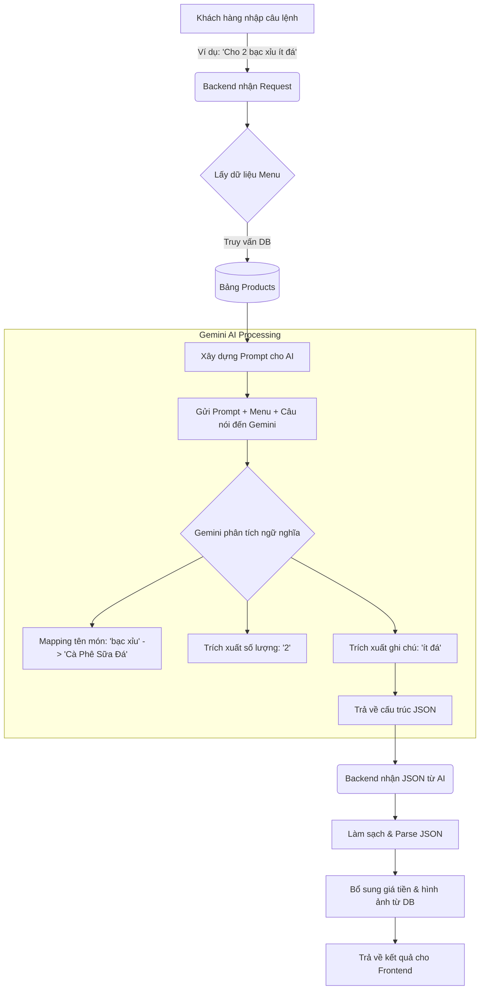

# 🚀 HƯỚNG DẪN BẢO VỆ ĐỒ ÁN: NERO COFFEE SYSTEM

Tài liệu này tổng hợp các lưu ý, kịch bản demo và các câu hỏi thường gặp để bạn tự tin bảo vệ đồ án **"Hệ thống Quản lý Quán Cà phê tích hợp Trợ lý Trí tuệ nhân tạo (Nero Coffee)"** trước hội đồng.

---

## 1. Chuẩn bị Kỹ thuật (Trình diễn)
Trước khi hội đồng vào, hãy đảm bảo hệ thống đã sẵn sàng:
- **Backend**: Đã chạy (`pnpm dev` tại thư mục `backend`). Check kết nối CSDL MySQL.
- **Frontend**: Đã chạy (`pnpm dev` tại thư mục `frontend`).
- **Trình duyệt**: Mở sẵn 2 tab (hoặc 2 cửa sổ song song):
    1. **Tab Khách hàng**: `http://localhost:5173` (Dùng để đặt món).
    2. **Tab Admin**: `http://localhost:5173/admin` (Dùng để quản lý đơn hàng/bàn).
- **Thiết bị**: Kiểm tra Micro (vì có demo tính năng Voice-to-Text). Đảm bảo mạng ổn định để gọi API Gemini.

---

## 2. Cấu trúc Bài thuyết trình (Gợi ý 10-15 phút)

1.  **Mở đầu (1-2p)**: Giới thiệu tên đề tài, lý do chọn đề tài (Số hóa quy trình bán hàng, ứng dụng AI để tối ưu trải nghiệm khách hàng).
2.  **Công nghệ sử dụng (2p)**: 
    *   **Frontend**: ReactJS, Vite, TailwindCSS (nếu có), Context API.
    *   **Backend**: Node.js, Express.
    *   **Database**: MySQL.
    *   **Đặc biệt**: **Google Gemini AI** (LLM) và **Socket.IO** (Real-time).
3.  **Demo Chức năng Chính (5-7p)**: Tập trung vào 3 kịch bản "ăn điểm" (xem mục 3 bên dưới).
4.  **Kết luận & Hướng phát triển (1p)**: Tích hợp thanh toán QR tự động, phân tích xu hướng đồ uống bằng AI.

---

## 3. Kịch bản Demo "Ghi điểm"

### Kịch bản 1: Trải nghiệm AI (Điểm nhấn sáng tạo)
- **Hành động**: Mở Chatbot, bấm Micro nói: *"Cho mình 2 bạc xỉu ít đá và 1 trà đào cam sả"*.
- **Giải thích**: "Hệ thống sử dụng Gemini Flash để phân tích ý định (Intent Parsing). Thay vì khách phải tìm món trong menu, AI tự động nhận diện tên món và số lượng, sau đó 'đẩy' trực tiếp vào giỏ hàng."
- **Chốt**: "Điều này giúp khách hàng đặt món nhanh hơn và tạo cảm giác hiện đại."

#### 📊 Sơ đồ quy trình xử lý của AI:

### Kịch bản 2: Quy trình Real-time (Tính thực tế)
- **Hành động**: Đặt đơn tại Tab Khách. Ngay lập tức, Tab Admin hiện thông báo và cập nhật đơn hàng mới mà không cần F5.
- **Giải thích**: "Em sử dụng Socket.IO để thiết lập kết nối song công. Khi có đơn hàng mới, Server sẽ 'phát tin' (emit) đến tất cả các máy trạm Admin để xử lý kịp thời, giảm thời gian chờ của khách."

### Kịch bản 3: Quản lý Bàn & Thanh toán
- **Hành động**: Chuyển sang Tab Admin -> Quản lý bàn. Cho thấy bàn 1 đang 'Có khách' (màu đỏ). Bấm thanh toán để giải phóng bàn.
- **Giải thích**: "Hệ thống quản lý trạng thái bàn trực quan, giúp nhân viên thu ngân kiểm soát không gian quán dễ dàng."

---

## 4. Các câu hỏi thường gặp (Q&A)

### Câu 1: Tại sao em dùng Gemini AI mà không phải là một bộ lọc từ khóa đơn giản?
**Trả lời**: "Dùng bộ lọc từ khóa (Regex) rất cứng nhắc. Nếu khách nói 'Thêm cho mình một đen đá' hoặc 'Lấy tớ 1 ly cafe đen có đá', Regex sẽ khó xử lý. Gemini là mô hình ngôn ngữ lớn (LLM), nó hiểu được ngữ cảnh và các cách diễn đạt khác nhau của tiếng Việt, giúp hệ thống thông minh và linh hoạt hơn."

### Câu 2: Em xử lý bảo mật như thế nào trong hệ thống?
**Trả lời**: 
- "Ở Backend, em sử dụng **JWT (JSON Web Token)** để xác thực người dùng. Các API của Admin đều được bảo vệ bởi Middleware, nếu không có Token hợp lệ hoặc Role không phải Admin thì sẽ bị từ chối."
- "Mật khẩu người dùng được băm (hash) trước khi lưu vào DB (sử dụng thư viện `bcrypt`)."

### Câu 3: Nếu mất kết nối Internet, AI có hoạt động được không?
**Trả lời**: "Vì AI sử dụng API của Google (Cloud-based), nên cần Internet để hoạt động. Tuy nhiên, các chức năng đặt món thủ công bằng cách bấm chọn vẫn hoạt động bình thường qua mạng nội bộ (Local Network) nếu triển khai server tại quán."

### Câu 4: Làm sao để AI biết quán có những món gì để thêm vào giỏ?
**Trả lời**: "Trong cấu trúc Prompt gửi lên Gemini, em đã đính kèm danh sách tên các sản phẩm hiện có trong Cơ sở dữ liệu. AI sẽ so khớp lời nói của khách với danh sách này để trả về mã ID sản phẩm chính xác."

---

## 5. Chi tiết kỹ thuật về AI (LLM & Prompt Engineering)

Nếu hội đồng hỏi sâu về mã nguồn xử lý AI, bạn hãy trình bày các file sau:

### 1. File xử lý cốt lõi: `backend/controllers/aiController.js`
Đây là "trái tim" của tính năng AI. Quy trình xử lý tại đây bao gồm:
- **Tích hợp SDK**: Sử dụng thư viện `@google/generative-ai` từ Google.
- **Model**: Sử dụng dòng `Gemini Flash` (tối ưu về tốc độ phản hồi và chi phí).
- **Kỹ thuật Prompt Engineering**: 
    - Gửi kèm danh sách Sản phẩm (Menu) lấy từ Database dưới dạng JSON để AI biết quán đang bán gì.
    - Ép kiểu (Constraint) AI chỉ được trả về định dạng JSON thuần để máy tính có thể đọc được ngay.
- **Mapping logic**: AI được hướng dẫn để tự động khớp các từ địa phương (như "bạc xỉu", "nâu đá") sang tên món chuẩn trong CSDL.

### 2. Các file liên quan khác:
- **`backend/routes/aiRoutes.js`**: Định nghĩa endpoint cho tính năng parse đơn hàng.
- **`frontend/src/components/AIBot.tsx`**: Giao diện khung chat, xử lý thu âm (Voice Recording) và gửi text lên Backend.
- **`.env`**: Lưu trữ `GEMINI_API_KEY`. (Lưu ý: Không bao giờ đẩy file này lên GitHub công khai).

---

## 6. Mẹo để bảo vệ thành công
1.  **Tự tin vào "Điểm Sáng"**: Luôn nhắc lại cụm từ "Trợ lý AI" và "Thời gian thực" vì đây là 2 yếu tố giúp đồ án của bạn cao điểm hơn các web bán hàng thông thường.
2.  **Chuẩn bị dữ liệu mẫu**: Đừng để CSDL trống. Hãy nhập sẵn khoảng 10-15 món ăn, ảnh đẹp, 2-3 tài khoản demo.
3.  **Thú nhận và Hướng giải quyết**: Nếu gặp lỗi lúc demo, hãy bình tĩnh giải thích: "Đây là lỗi về [kết nối/timeout], em đã có phương án xử lý là [ABC] nhưng chưa kịp đóng gói bản cập nhật này." (Đừng nói 'Em không biết').

---
**Chúc bạn có một buổi bảo vệ thành công rực rỡ! ☕✨**
Tài khoản admin:
admin@coffee.com
Mật khẩu:
admin123